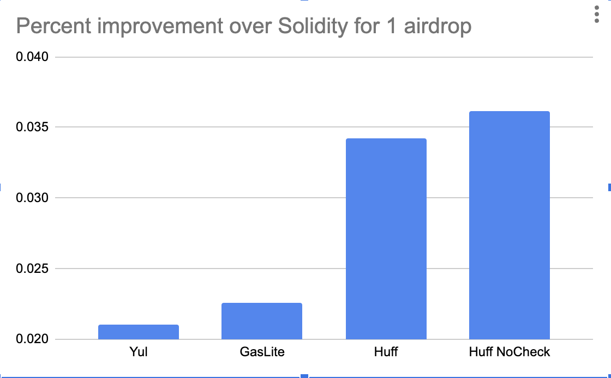
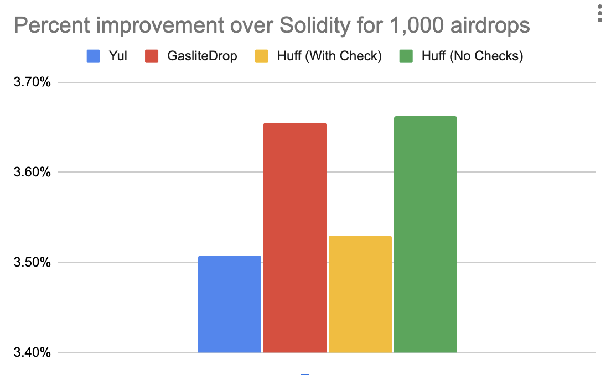

# TSender

## Percent Gas Efficiency Improvement vs Solidity
<p align="center">

<br/>

- [TSender](#tsender)
  - [Percent Gas Efficiency Improvement vs Solidity](#percent-gas-efficiency-improvement-vs-solidity)
- [Deployment addresses](#deployment-addresses)
  - [Tsender.sol](#tsendersol)
  - [Tsender.huff](#tsenderhuff)
  - [Tsender\_NoCheck.huff](#tsender_nocheckhuff)
- [About](#about)
  - [TSender Features](#tsender-features)
  - [GasliteDrop Comparison](#gaslitedrop-comparison)
  - [Gas Comparisons](#gas-comparisons)
    - [Efficiency Improvement vs Solidity](#efficiency-improvement-vs-solidity)
    - [Actual Gas Costs](#actual-gas-costs)
- [Getting Started](#getting-started)
  - [Requirements](#requirements)
    - [foundry-zksync](#foundry-zksync)
  - [Installation](#installation)
  - [Quickstart / Usage](#quickstart--usage)
    - [Testing](#testing)
    - [Testing with zkSync](#testing-with-zksync)
      - [Why no stateful fuzz tests?](#why-no-stateful-fuzz-tests)
    - [Deployment](#deployment)
- [Audit Data](#audit-data)
  - [Known issues](#known-issues)
  - [Scope](#scope)
  - [Chain compatibility and token compatibility](#chain-compatibility-and-token-compatibility)
    - [Target deployment chains by contracts](#target-deployment-chains-by-contracts)
    - [Target deployment tokens by chains:](#target-deployment-tokens-by-chains)
  - [Notes](#notes)
- [Acknowledgements](#acknowledgements)

# Deployment addresses

## Tsender.sol
- [ZKsync](https://explorer.zksync.io/address/0x7e645Ea4386deb2E9e510D805461aA12db83fb5E)
- [Optimism](https://optimistic.etherscan.io/address/0xAaf523DF9455cC7B6ca5637D01624BC00a5e9fAa)
- [Sepolia](https://sepolia.etherscan.io/address/0xa27c5C77DA713f410F9b15d4B0c52CAe597a973a)

## Tsender.huff
- [Ethereum](https://etherscan.io/address/0x3ad9f29ab266e4828450b33df7a9b9d7355cd821)
- [Arbitrum](https://arbiscan.io/address/0xa2b5aedf7eef6469ab9cbd99de24a6881702eb19)
- [Optimism](https://optimistic.etherscan.io/address/0x95b9aa5ef74d93f17d0a4f025ed23a2d7df69220)
- [Base](https://basescan.org/address/0x31801c3e09708549c1b2c9e1cfbf001399a1b9fa)

## Tsender_NoCheck.huff
- [Ethereum](https://etherscan.io/address/0x7d4a746cb398e5ae19f6cbdc08473664adbc6da5)
- [Arbitrum](https://arbiscan.io/address/0x091bab6497f2cc429c82c5807df4faa34235cccc)
- [Optimism](https://optimistic.etherscan.io/address/0xa0c7ada2c7c29729d12e2649bc6a0a293ac46725)
- [Base](https://basescan.org/address/0x39338138414df90ec67dc2ee046ab78bcd4f56d9)

# About

Hyper gas efficient smart contracts for air dropping tokens to a large number of users. Inspired by the work of the [Gaslite team](https://github.com/PopPunkLLC/GasliteDrop/tree/main). In the `src` folder, we have 4 main contracts:
- `TSender.sol`: The Yul/Solidity implementation 
- `TSender.huff`: The Huff implementation
- `TSender_NoCheck.huff`: The Huff implementation without the extra checks, making the output similar to `GasliteDrop`. Much more gas efficient, but without any safety rails. 
- `TSenderReference.sol`: The pure Solidity implementation

Each contract has 1 or 2 functions:
- `airdropERC20` (required): A function that takes in an array of recipients and an array of amounts, and sends the amounts to the recipients.
- `areValidLists` (optional): A function that takes in an array of recipients and an array of amounts, and checks if the lists are valid.

## TSender Features 
- Checks the `totalAmount` parameter matches the sum of the `amounts` array
- Doesn't allow ETH to be sent with function calls
- Makes sure the total lengths of the `amounts` array and `recipients` array are the same
- Checks for zero address recipients 

Additionally, we did not want to spend gas checking a few things, so we added a function called `areListsValid` that takes in a `address[] recipients` and `uint256[] amounts` to check for:
- Duplicate addresses
- Zero address sends 
- There is at least 1 recipient
- All amounts are > 0
- recipients.length == amounts.length

## GasliteDrop Comparison

The work here was inspired by the [Gaslite team](https://github.com/PopPunkLLC/GasliteDrop/tree/main) with a few changes.

1. The Yul & Huff have added safety checks (see [TSender Features](#tsender-features))
2. The `TSender_NoCheck.huff` does not have the extra checks, but is just a gas optimized version of the original GasliteDrop contract.

## Gas Comparisons

> Note: Since our implementation adds more checks, the Huff code is slightly *less* gas efficient when working with additional recipients than the original gaslite codebase, but it is a safer smart contract. However, we did include a Huff contract the did not include those checks to show the power of using Huff to reduce gas costs.

### Efficiency Improvement vs Solidity					
| # of recipients | Yul   | Gaslite | Huff  | Huff (No Checks) |
| --------------- | ----- | ------- | ----- | ---------------- |
| 1               | 2.10% | 2.26%   | 3.42% | 3.61%            |
| 10              | 3.23% | 3.38%   | 3.51% | 3.65%            |
| 100             | 3.48% | 3.62%   | 3.52% | 3.66%            |
| 1000            | 3.51% | 3.66%   | 3.53% | 3.66%            |

### Actual Gas Costs
|                      | Solidity | Yul      | Gaslite  | Huff     | Huff, no check |
| -------------------- | -------- | -------- | -------- | -------- | -------------- |
| 1 Recipient Drop     | 57377    | 56170    | 56080    | 55409    | 55300          |
| 10 Recipient Drops   | 295287   | 285737   | 285296   | 284931   | 284507         |
| 100 Recipient Drops  | 2674618  | 2581616  | 2577665  | 2580360  | 2576786        |
| 1000 Recipient Drops | 26490540 | 25561280 | 25522229 | 25553551 | 25520471       |

<p align="center">

<br/>

# Getting Started

## Requirements 

- [git](https://git-scm.com/book/en/v2/Getting-Started-Installing-Git)
  - You'll know you did it right if you can run `git --version` and you see a response like `git version x.x.x`
- [foundry](https://getfoundry.sh/)
  - You'll know you did it right if you can run `forge --version` and you see a response like `forge 0.2.0 (816e00b 2023-03-16T00:05:26.396218Z)`
- [huff](https://docs.huff.sh/get-started/installing/)
  - You'll know you did it right if you can run `huffc --version` and you see a response like `huffc 0.3.2`
- [halmos](https://github.com/a16z/halmos)
  - You'll know you've done it right if you can run `halmos --version` and you see a response like `Halmos 0.1.12`

### foundry-zksync

When we work with zksync, we plan to use [foundry-zksync](https://github.com/matter-labs/foundry-zksync). You'll know you did it right if you can run `forge --version` and you see a response like `forge 0.0.2 (816e00b 2023-03-16T00:05:26.396218Z)`. At the moment, it doesn't play nicely with Huff, so when we go to build with zksync, we remove all the Huff related code. 

## Installation

```bash
git clone https://github.com/cyfrin/tsender
cd tsender
make
```

## Quickstart / Usage

### Testing

To test the codebase, you can run the following 2 commands:

```bash
make test
make halmos
```

### Testing with zkSync

To test with zkSync, we must first remove our `Huff` tests. We will not be deploying the huff code to zkSync, and the codebases doesn't play nice with `foundry-zksync`.

To run zkSync tests:

1. Comment out the following files
   1. `TSenderHuffTest.t.sol`
   2. `TSenderHuffNoCheckTest.t.sol`
   3. `EquivalenceTest.sol`
   4. `DeployHuff.s.sol`
You'll need to leave this line uncommented in each file:
```javascript
pragma solidity 0.8.24;
```
1. Run the tests:
```bash
make zktest
```
or
```
forge test --zksync
```

*We have an issue in `foundry-zksync` to fix the issue with `avoid-contracts`. That would be the ideal solution in the future.*

#### Why no stateful fuzz tests?

Our contract is expected to never have state. There are no `SSTORE` opcodes in the bytecode of this contract.

### Deployment

You'll need to uncomment out the `DeployHuff.s.sol` codebase. It's commented out because zkSync has a hard time compiling it at the moment. This is ok because we do not intend to deploy huff to zksync. 

```
make deployYul 
make deployHuff
```

# Audit Data

## Known issues
- Does not work with fee-on-transfer tokens
- Does not check the return value of ERC20s, but it does check to see if the `transferFrom` or `transfer` call was successful. Meaning ERC20s that return `false` on a failed `transfer` or `transferFrom` but successfully execute, are not supported. If any of the expected token integrations are vulnerable to this pattern, flag it. 
- Upgradable/Deny List tokens can prevent this contract from working. We expect that, in the case that this contract or any recipient is on a deny list, the entire transaction will revert. 

## Scope

```bash
#-- interfaces
|   #-- ITSender.sol
#-- protocol
|   #-- TSender.huff
|   #-- TSender.sol
|   #-- TSender_NoCheck.huff
```

Ignore:
```bash
#-- reference
    #-- TSenderReference.sol
#-- script/
```

Deploy scripts are not in scope because we can easily redeploy if we have an issue. 

## Chain compatibility and token compatibility

We expect to be able to run our deploy scripts, and it will prevent us from deploying contracts to chains that are not supported. Right now, zkSync will work with the `yul` based `TSender.sol`, and all other chains listed in the `HelperConfig.sol` will work with the `TSender.huff` contract. 

### Target deployment chains by contracts
- `TSender.sol`:
  - zkSync Era
  - Everything in the `TSender.huff` list
- `TSender.huff`:
  - Ethereum 
  - Arbitrum
  - Optimism
  - Base

### Target deployment tokens by chains:
- ZKSync Era:
  - USDC
  - WETH
  - LINK
- Ethereum:
  - USDC
  - WETH
  - LINK
- Arbitrum:
  - USDC
  - WETH
  - LINK
- Optimism:
  - USDC
  - WETH
  - LINK
- Base:
  - USDC
  - WETH
  - LINK

## Notes
- There is an issue with how quickly the `foundry-zksync` compiler works, so we avoid compiling the `DeployHuff.s.sol` contract. 
- Compliation takes a *long* time, so run tests accordingly. It may make sense to run tests with the standard foundry implementation before swapping to the `foundry-zksync` implementation.
- Please take note of the target deployment chains during audit and check to see if our Huff or Solidity will work there.

# Acknowledgements
- [Gaslite](https://github.com/PopPunkLLC/GasliteDrop)
- [PopPunkOnChain](https://twitter.com/PopPunkOnChain)
- [Vectorized](https://github.com/Vectorized/)
- [backseats_eth](https://twitter.com/backseats_eth)
